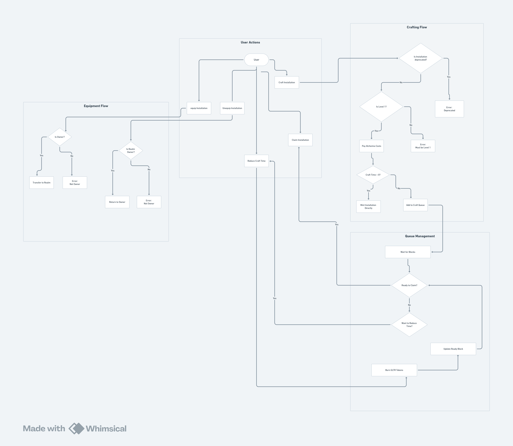

## InstallationFacet.sol Technical Review

### Overview
The `InstallationFacet` contract is part of the Aavegotchi Realm ecosystem, specifically designed to manage installations, which are in-game assets (such as buildings, decorations, and equipment) that users can craft, equip, and upgrade on their parcels (virtual land in the game). This contract facilitates querying balances, managing crafting queues, and equipping/unequipping installations on parcels. It interacts with other facets and libraries, such as `LibERC1155`, `LibItems`, and `LibInstallation`, to handle ERC1155 tokens and crafting logic.

### Scopes and Responsibilities

- **Installation Management**: Manages installations, their crafting, queuing, and equipping on parcels.
- **Queue Handling**: Handles queuing of installation crafting and retrieval, enabling time-based functionality.
- **Diamond Standard**: Follows the **EIP-2535 Diamond Standard**, which splits the contract’s code into facets (e.g., this `InstallationFacet`) to enable modular upgrades and maintain an efficient contract structure.


## Game Terminology & Concepts

### Core Concepts
1. **Parcel**: A plot of virtual land in the Aavegotchi metaverse where installations can be placed
2. **Installation**: Buildings or structures that can be crafted and placed on parcels
3. **Alchemica**: Four types of in-game resources used for crafting
4. **GLTR (Gotchus Alchemica Token)**: A special token used to speed up crafting times
5. **Craft Time**: The number of blocks that must pass before an installation is ready
6. **Spillover**: Resource distribution mechanism from reservoir installations

### Installation Types
1. **Altars**: Fundamental installations for parcel improvement
2. **Reservoirs**: Structures that manage and distribute Alchemica resources
3. **Lodges**: Player gathering and social structures

### Key Components
1. **Structs**
   - **InstallationIdIO**: Represents an installation with an ID and balance.
   - **ReservoirStats**: Contains spill rate, radius, and capacity details for a "reservoir" installation type.
   - **BatchCraftInstallationsInput**: Used for batch crafting installations with specified IDs, amounts, and GLTR (currency) allocation.

2. **Events**
   - **AddedToQueue**: Emitted when an installation is added to the crafting queue.
   - **QueueClaimed**: Emitted when an installation is claimed after crafting.
   - **CraftTimeReduced**: Emitted when the craft time of an installation is reduced.
---

### Primary Functionalities

#### Read Functions


These functions are primarily for querying data about installations and queues.

#### `installationsBalances`
```solidity
function installationsBalances(address _account) external view returns (InstallationIdIO[] memory bals_) {
    uint256 count = s.ownerInstallations[_account].length;
    bals_ = new InstallationIdIO[](count);
    for (uint256 i; i < count; i++) {
      uint256 installationId = s.ownerInstallations[_account][i];
      bals_[i].balance = s.ownerInstallationBalances[_account][installationId];
      bals_[i].installationId = installationId;
    }
}
```

- **Purpose**: Returns an array of installation balances owned by `_account`.
- **Analysis**: Loops through the installations owned by `_account` and retrieves the balance for each.


#### `installationsBalancesWithTypes`
```solidity
function installationsBalancesWithTypes(address _owner) external view returns (ItemTypeIO[] memory output_) {
    uint256 count = s.ownerInstallations[_owner].length;
    output_ = new ItemTypeIO[](count);
    for (uint256 i; i < count; i++) {
      uint256 installationId = s.ownerInstallations[_owner][i];
      output_[i].balance = s.ownerInstallationBalances[_owner][installationId];
      output_[i].itemId = installationId;
      output_[i].installationType = s.installationTypes[installationId];
    }
}
```

- **Purpose**: Returns balances and types of installations owned by `_owner`.
- **Analysis**: Provides additional installation type data, useful for front-end displays and integration with other facets.


#### `balanceOfToken`
```solidity
function balanceOfToken(
    address _tokenContract,
    uint256 _tokenId,
    uint256 _id
) public view returns (uint256 value) {
    value = s.nftInstallationBalances[_tokenContract][_tokenId][_id];
}
```

- **Purpose**: Fetches the balance of an installation (`_id`) for a parent ERC721 token (`_tokenContract`, `_tokenId`).
- **Security Consideration**: Confirm that the `_tokenContract` is trusted and compliant with ERC721 to prevent interaction with malicious contracts.


#### `installationBalancesOfToken`
```solidity
function installationBalancesOfToken(address _tokenContract, uint256 _tokenId) public view returns (InstallationIdIO[] memory bals_) {
    uint256 count = s.nftInstallations[_tokenContract][_tokenId].length;
    bals_ = new InstallationIdIO[](count);
    for (uint256 i; i < count; i++) {
      uint256 installationId = s.nftInstallations[_tokenContract][_tokenId][i];
      bals_[i].installationId = installationId;
      bals_[i].balance = s.nftInstallationBalances[_tokenContract][_tokenId][installationId];
    }
}
```

- **Purpose**: Retrieves ERC1155 items linked to a specified ERC721 token.


####  `spilloverRateAndRadiusOfId`: 
- Checks the spillover rate and radius for a given installation type.

#### `getInstallationType`
```solidity
function getInstallationType(uint256 _installationTypeId) 
    external view returns (InstallationType memory)
```
- **Purpose:** Retrieves complete details about an installation type
- **Returns installation properties including:**
  - Craft time (in blocks)
  - Resource costs
  - Level requirements
  - Deprecation status
  - Spillover mechanics for reservoirs

#### `getReservoirStats`
```solidity
function getReservoirStats(uint256 _installationId) 
    external view returns (ReservoirStats memory)
```
Purpose: Gets specific details for reservoir-type installations
```solidity
struct ReservoirStats {
    uint256 spillRate;    // Rate of resource distribution
    uint256 spillRadius;  // Area affected by spillover
    uint256 capacity;     // Maximum resource storage
}
```


#### Write Functions
These functions manage crafting, equipping, and upgrading installations.

#### `_batchCraftInstallation`
```solidity
function _batchCraftInstallation(BatchCraftInstallationsInput calldata _batchCraftInstallationsInput) internal {
    uint16 installationID = _batchCraftInstallationsInput.installationID;
    uint16 amount = _batchCraftInstallationsInput.amount;
    require(amount > 0, "InstallationFacet: Craft amount cannot be zero");
    
    // Fetch required resources
    address[4] memory alchemicaAddresses = RealmDiamond(s.realmDiamond).getAlchemicaAddresses();
    uint256[4] memory alchemicaCost;
    require(installationID < s.installationTypes.length, "InstallationFacet: Installation does not exist");
    
    // Distribute costs and queue if needed
    if (s.deprecateTime[installationID] > 0) {
        require(block.timestamp < s.deprecateTime[installationID], "InstallationFacet: Installation has been deprecated");
    }
    require(!s.installationTypes[installationID].deprecated, "InstallationFacet: Installation has been deprecated");
    
    // Mint directly or queue based on craft time
    if (s.installationTypes[installationID].craftTime == 0) {
        LibERC1155._safeMint(msg.sender, installationID, amount, false, 0);
    }
    // else - handle queueing (commented out in provided code)
}
```

- **Purpose**: Internal function that performs the crafting of installations, deducting necessary resources and placing the installation in the queue if required.


#### `batchCraftInstallations`
```solidity
function batchCraftInstallations(BatchCraftInstallationsInput[] calldata _inputs) external {
    for (uint256 i = 0; i < _inputs.length; i++) {
        _batchCraftInstallation(_inputs[i]);
    }
}
```


- **Purpose**: Allows users to batch-craft multiple installations, leveraging `_batchCraftInstallation` internally.
- **Process:**
  1. Validates installation exists and isn't deprecated
  2. Checks level 1 requirement
  3. Calculates total Alchemica cost
  4. Creates installations or adds to queue
  5. Handles GLTR acceleration if specified


#### `craftInstallations`
```solidity
function craftInstallations(
    uint16[] calldata _installationTypes, 
    uint40[] calldata _gltr
) external
```
- **Purpose**: Allows users to craft multiple installations and adds them to a queue if the craft time is non-zero.
- **Key Differences from batch crafting:**
  - Processes one installation at a time
  - More granular GLTR usage per installation
  - Individual queue entries


#### `claimInstallations`
```solidity
function claimInstallations(uint256[] calldata _queueIds) external {
    for (uint256 i; i < _queueIds.length; i++) {
        uint256 queueId = _queueIds[i];
        QueueItem memory queueItem = s.craftQueue[queueId];
        
        require(msg.sender == queueItem.owner, "InstallationFacet: Not owner");
        require(!queueItem.claimed, "InstallationFacet: already claimed");
        require(block.number >= queueItem.readyBlock, "InstallationFacet: Installation not ready");
        
        LibERC1155._safeMint(msg.sender, queueItem.installationType, 1, true, queueItem.id);
        s.craftQueue[queueId].claimed = true;
        emit QueueClaimed(queueId);
    }
}
```

- **Purpose**: Allows users to claim crafted installations once they are ready.

- **Requirements:**
  - Caller must be queue item owner
  - Installation must not be already claimed
  - Required blocks must have passed (readyBlock reached)

- **Actions:**
  1. Validates claim requirements
  2. Mints installation NFT to claimer
  3. Marks queue item as claimed
  4. Emits QueueClaimed event
- **Security Consideration**: **Access Control** – Ensure only the rightful owner can claim a queued installation, preventing unauthorized claims.
- **Analysis**: Ensures installations are only claimable once ready, enforcing game mechanics that add value to in-game assets.


#### `reduceCraftTime`
```solidity
function reduceCraftTime(uint256[] calldata _queueIds, uint40[] calldata _amounts) external {
    require(_queueIds.length == _amounts.length, "InstallationFacet: Mismatched arrays");
    for (uint256 i; i < _queueIds.length; i++) {
        uint256 queueId = _queueIds[i];
        QueueItem storage queueItem = s.craftQueue[queueId];
        require(msg.sender == queueItem.owner, "InstallationFacet: Not owner");
        require(block.number <= queueItem.readyBlock, "InstallationFacet: installation already done");
        
        uint40 blockLeft = queueItem.readyBlock - uint40(block.number);
        uint40 removeBlocks = _amounts[i] <= blockLeft ? _amounts[i] : blockLeft;
        
        // Burn GLTR tokens for reduced time
        IERC20 gltr = IERC20(s.gltr);
        gltr.burnFrom(msg.sender, uint256(removeBlocks) * 10**18);
        queueItem.readyBlock -= removeBlocks;
        
        emit CraftTimeReduced(queueId, removeBlocks);
    }
}
```

- **Purpose**: Allows users to reduce crafting time by burning `$GLTR` tokens.
- **Mechanics:**
  - Each`$GLTR` token reduces craft time by 1 block
  - Cannot reduce beyond current block
  - Burns GLTR tokens upon use
  - Updates readyBlock timestamp

#### `equipInstallation`
```solidity
function equipInstallation(
    address _owner,
    uint256 _realmId,
    uint256 _installationId
) external onlyRealmDiamond
```
- **Purpose**: Equips an installation to a specified parcel, called by the parcel diamond contract.
- **Requirements**:
  - Called only by Realm Diamond contract
  - Owner must own both parcel and installation
  - Parcel must have available space
  - Installation must be compatible with parcel

#### `unequipInstallation`
```solidity
function unequipInstallation(
    address _owner,
    uint256 _realmId,
    uint256 _installationId
) external onlyRealmDiamond
```
- **Purpose**: Removes an installation from a specified parcel, also called by the parcel diamond contract.
- **Process**:
  1. Validates ownership and equipped status
  2. Stops any ongoing resource generation
  3. Updates parcel state
  4. Returns installation to owner's inventory

---
### Installation Lifecycle Diagram

The InstallationFacet contract in the Aavegotchi Realm Diamond handles the core functionality for crafting, managing, and equipping installations. The main flows are as follows:



**1. Crafting Flow**:
- Users can call `craftInstallations` or `batchCraftInstallations` to craft new installations.
- The contract first checks if the requested installation type is deprecated or not a level 1 installation, and throws an error if either of these conditions is true.
- If the requirements are met, the contract deducts the required alchemica costs from the user.
- Depending on the installation's craft time:
  - If the craft time is 0, the contract mints the installation directly to the user.
  - If the craft time is greater than 0, the contract adds the installation to the craft queue.

**2. Queue Management**:
- When an installation is added to the craft queue, it is associated with the following details:
  - Owner address
  - Installation type
  - Ready block (block number when it will be ready to claim)
  - Claimed status
  - Unique queue ID
- Users can call `claimInstallations` to claim any installations that have reached their ready block.
- If an installation in the queue is not yet ready, users can call `reduceCraftTime` to speed up the process by burning GLTR tokens.
  - This updates the ready block of the queue item, reducing the remaining time.
  - After updating the ready block, the flow loops back to check if the installation is now ready to claim.

**3. Equipment Flow**:
- Users can call `equipInstallation` to equip an installation to a realm parcel.
  - This function checks if the caller is the realm diamond contract, and if the user owns the installation.
  - If the checks pass, the installation is transferred to the realm.
- Users can call `unequipInstallation` to remove an installation from a realm parcel.
  - This function also checks if the caller is the realm diamond contract, and if the realm owns the installation.
  - If the checks pass, the installation is returned to the owner's balance.

**4. Core State Tracking**:
- The contract maintains a registry of installation types, each with properties such as alchemica costs, craft time, level, and deprecation status.
- It also tracks balances for installations owned by individual users, as well as those owned by NFT (realm) tokens.
- Special installation types like Altars, Lodges, and Reservoirs have additional properties stored in the contract.

---


### Summary
The `InstallationFacet` contract is a complex, multi-functional component within the Aavegotchi ecosystem that enables users to manage their installation assets efficiently. By structuring installation crafting, queuing, and equipping processes, it allows for a rich user experience in virtual asset management. The contract's integration with other libraries like `LibERC1155` and `LibItems` further facilitates ERC1155 handling and resource management.

This review provides a foundational understanding of the `InstallationFacet`'s functionality and how it supports crafting, queuing, and asset management in the Aavegotchi Realm.


